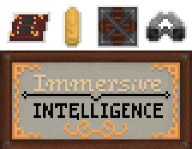

   

 

  

### Description

**Immersive Intelligence** is a Minecraft mod, an addon for Immersive Engineering for 1.12.2. Mod is still in work-in-progress state, so **most of the planned features are not added**. There are four main categories of the mod's content: 

 - **Data and Electronics** - alows the player to transmit signals on the data network via packets of variables, there are many multiblock machines which allow reading, writing, transmitting and receiving data, allowing it to be an upgraded version of redstone
  
 - **Logistics** - great storage and crafting system based on multiblocks, data transmission and drones, it will be customizable while staying as immersive as possible. Includes skycrates!
 
 - **Warfare** - weapons of all sorts - machineguns, submachineguns, autocannons, railguns, chemthrowers, combat drones, howitzers, mines, missiles and much more
 
 - **Intelligence** - espionage - stealth - sabotage - this category contains surveillance devices, such as the Infrared Observer and Tripod Periscope which allow you to spy on other players and monitor the world
 
 The mod also features the new rotary power system.

### Credits

#### Mod Author, Main Developer:
- [@Pabilo8](https://github.com/Pabilo8/) - Main Developer, the Programmer, Graphic Artist and Modeller 
  - [Curseforge](https://www.curseforge.com/members/pabilo8/), 
  - [Twitter](https://twitter.com/PablosferaGames), 
  - [YouTube](https://www.youtube.com/channel/UCXTK248mxwBgwCpV5hikjFg)

#### Team Immersive Intelligence
- [@Carver](https://github.com/Carvercarver1) - Main Modeller, Animator, Archivist, Assistant, a fellow howitzer enthusiast and world destroyer
  - [Curseforge](https://www.curseforge.com/members/john__carver/)  
- [@Schäferd](https://github.com/Schaeferd-CZ) - UV Mapper, Texturer, Modeller, Animator, Artist, a fellow retro-futurist and also *The Czech™*
  - [Curseforge](https://www.curseforge.com/members/schaeferd_cz/)  
- [@Bastian](https://github.com/RexBas07) - Editor of the Engineer's Manual, a fellow logistics enjoyer and *The Other Swede™*
- [@VDeltaGabriel](https://github.com/VDeltaGabriel) - Programmer, Assistant in Logical Design and a fellow Pole™

#### Special thanks to:
- [@Flaxbeard](https://github.com/Flaxbeard) - for code snippets, approval of this mod and friendliness, during its release in 2020

- [@Kingcavespider1](https://github.com/kingcavespider1) - first community contribution to mod's GitHub
- [@H-QueerCoded](https://github.com/H-QueerCoded) - for code snippets, approval of this mod and friendliness, during its release in 2020
  

- [@Choroman](https://github.com/Choroman) - Retired Concept Artist, multiblock sketch and blueprint creator, modeller
- [@Krystiano0306](https://github.com/Krystiano0306) - Helped at various model-related jobs as a part of his practice, retired
- [@Blacknight](#) - Texture artist, created some textures for the mod's items

#### The Old Guard, long time enthusiasts of this mod:  
- [@Morten](https://github.com/Morten1202)
- [@KingSpios](https://github.com/KingSpios)
- [@RoyalJelly](https://github.com/Royal-Jelly)
- [@Cloakable](https://github.com/Cloakable)
- [@Lgrmszd](https://github.com/Lgmrszd)
- [@LeKripiY](https://github.com/LeKripiY)
- [@Shadowking](#)

#### Our Allies at Team IG
- [@CrimsonTwilight](https://github.com/NightmareTwilight) - author of [Immersive Energy](https://www.curseforge.com/minecraft/mc-mods/immersive-energy), an allied modder from Team IG, also *The Swede™*
  - [Curseforge](https://www.curseforge.com/members/crimsondragonrider)
- [@MuddyKat](https://github.com/NightmareTwilight) - Lead Developer of [Immersive Geology](https://www.curseforge.com/minecraft/mc-mods/immersive-geology), an allied modder from Team IG, also *The Australian™*
  - [Curseforge](https://www.curseforge.com/members/muddykats)  

#### Dependencies

Proudly using [Blockbench](https://www.blockbench.net/) - the minecraft modelling software:
- Author: [@JannisX11](https://github.com/JannisX11/)

Java models use a fork of **Turbo Model Thingy** (**TMT**):
- The original author: [@GaryCXJk](https://github.com/GaryCXJk)
- Licensed from: [Flan's Mod Team](https://github.com/FlansMods/FlansMod)

OBJ based models use our proprietary **AMT** library, included in `client.util.amt` in this mod's source code.  
Some code and assets are automatically generated through .  
If you wish to use these libraries in your project, message [@Pabilo8](https://github.com/Pabilo8/).

#### Please report any bugs you find in the ['Issues' tab](https://github.com/Team-Immersive-Intelligence/ImmersiveIntelligence/issues). Please don't do that on Curseforge / DM ^^.  
#### Feel free to join the mod's [Discord Server](https://discord.gg/teMfm3R) to have a chat with the devs and community.
