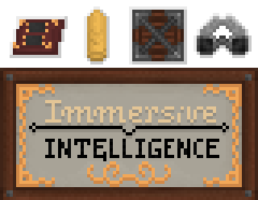

   

### Description

**Immersive Intelligence** is a Minecraft mod, an addon for Immersive Engineering for 1.12.2. There are four main categories of the mod's content:

- **Data and Electronics** – alows the player to transmit signals on the data network via packets of variables,
  there are many multiblock machines which allow reading, writing, transmitting and receiving data, allowing it to be an upgraded version of redstone

- **Logistics** – great storage and crafting system based on multiblocks, data transmission,
  and drones, it will be customizable while staying as immersive as possible. Includes skycrates!

- **Warfare** – weapons of all sorts – machine guns, submachine guns, autocannons, railguns, chemthrowers, combat drones, howitzers, mines, missiles, and much more

- **Intelligence** – espionage – infiltration – sabotage – this category contains surveillance devices,
  such as the Infrared Observer and Tripod Periscope, which allow you to spy on other players and monitor the world

Additionally, the mod adds:

- **Rotary Power** – early game mechanical power using wheels and motor belts, which can power machines like the sawmill and skycrate station

- **Motorworks** – production of various vehicles and their components, including a whole new production chain for rubber processing

The mod also features a new early game rotary power system.

### Dev Environment Setup

Check [contributing.md](./contributing.md) for detailed setup instructions.

### Credits

#### Mod Author, Main Developer:

- [@Pabilo8](https://github.com/Pabilo8/) - Main Developer, the Programmer, Graphic Artist, and Modeler
    - [Curseforge](https://www.curseforge.com/members/pabilo8/),
    - [Twitter](https://twitter.com/PablosferaGames),
    - [YouTube](https://www.youtube.com/channel/UCXTK248mxwBgwCpV5hikjFg)

#### Team Immersive Intelligence

- [@Carver](https://github.com/Carvercarver1) - Main Modeler, Animator, Archivist, Assistant, a fellow howitzer enthusiast, and world destroyer
- [@Schäferd](https://github.com/Schaeferd-CZ) - Currently retired - UV Mapper, Texturer, Modeler, Animator, Artist, a fellow retro-futurist and also
  *The Czech™*
- [@Bastian](https://github.com/RexBas07) - Editor of the Engineer's Manual and the Future Ideas™ folder, cardboard boxes enjoyer, also
  *The Other Swede™*
- [@Avalon](https://github.com/Avalon2106) - Programmer, helps us with miscellaneous fixes, works at the Department of Chemical Engineering
- [@VDeltaGabriel](https://github.com/VDeltaGabriel) - Programmer, Assistant in Logical Design, same kind of a madman as Carver
- [@Peter](https://github.com/Cordyceps22) - 3D Modeler, Artist, helps and maintains order in our Russian-speaking community
- [@Trej](https://github.com/trej32) - 3D Modeler, Texture, author of many vehicles, part of Trej-Tokarev Wagonzavod
- [@Tokarev](https://github.com/TokarevDrozd) - 3D Modeler, author of vehicles, the Soldier of II - he maintains order in Standards Documentation
- [@Maxis](https://github.com/Maxis175) - 3D Modeler, author of modern style vehicle models

#### Special thanks to:

- [@Flaxbeard](https://github.com/Flaxbeard) - for code snippets, approval of this mod, and his general friendliness, during its release in 2020

- [@Kingcavespider1](https://github.com/kingcavespider1) - first community contribution to mod's GitHub
- [@H-QueerCoded](https://github.com/H-QueerCoded) - for helpful pull requests and releasing the 0.2.1H build
- [@BananaFructa](https://github.com/Flaxbeard) - for making the first mod with II compatibility

- [@Choroman](https://github.com/Choroman) - Retired Concept Artist, multiblock sketch and blueprint creator, modeler
- [@Krystiano0306](https://github.com/Krystiano0306) - Helped at various model-related jobs as a part of his practice, retired
- [@Blacknight](#) - Texture artist, created some textures for the mod's items

- [@CarverBot](https://github.com/CarverBot) - Our Resource Optimization and Discord management bot, automated version of [@Carver](https://github.com/Carvercarver1)

#### The Old Guard, long time enthusiasts of this mod:

- [@Morten](https://github.com/Morten1202)
- [@KingSpios](https://github.com/KingSpios)
- [@RoyalJelly](https://github.com/Royal-Jelly)
- [@Cloakable](https://github.com/Cloakable)
- [@Lgrmszd](https://github.com/Lgmrszd)
- [@LeKripiY](https://github.com/LeKripiY)
- [@Shadowking](#)

#### Our Allies at Team IG

- [@Muddykat](https://github.com/NightmareTwilight) - Lead Developer of [Immersive Geology](https://www.curseforge.com/minecraft/mc-mods/immersive-geology), an allied modder from Team IG, also
  *The Australian™*
    - [Curseforge](https://www.curseforge.com/members/muddykats)
- [@CrimsonTwilight](https://github.com/NightmareTwilight) - author of [Immersive Energy](https://www.curseforge.com/minecraft/mc-mods/immersive-energy), an allied modder from Team IG, also
  *The Swede™*
    - [Curseforge](https://www.curseforge.com/members/crimsondragonrider)

#### Our Allies at Immersive Technology

- [@tgstyle](https://github.com/tgstyle)
- [@DotPrism](https://github.com/DotPrism)

#### Dependencies

Proudly using [Blockbench](https://www.blockbench.net/) - the minecraft modelling software:

- Author: [@JannisX11](https://github.com/JannisX11/)

Java models use a fork of **Turbo Model Thingy** (**TMT**):

- The original author: [@GaryCXJk](https://github.com/GaryCXJk)
- Licensed from: [Flan's Mod Team](https://github.com/FlansMods/FlansMod)

#### Please report any bugs you find in the ['Issues' tab](https://github.com/Team-Immersive-Intelligence/ImmersiveIntelligence/issues). Please don't do that on Curseforge / DM ^^.

#### Feel free to join the mod's [Discord Server](https://discord.gg/teMfm3R) to have a chat with the devs and community.
